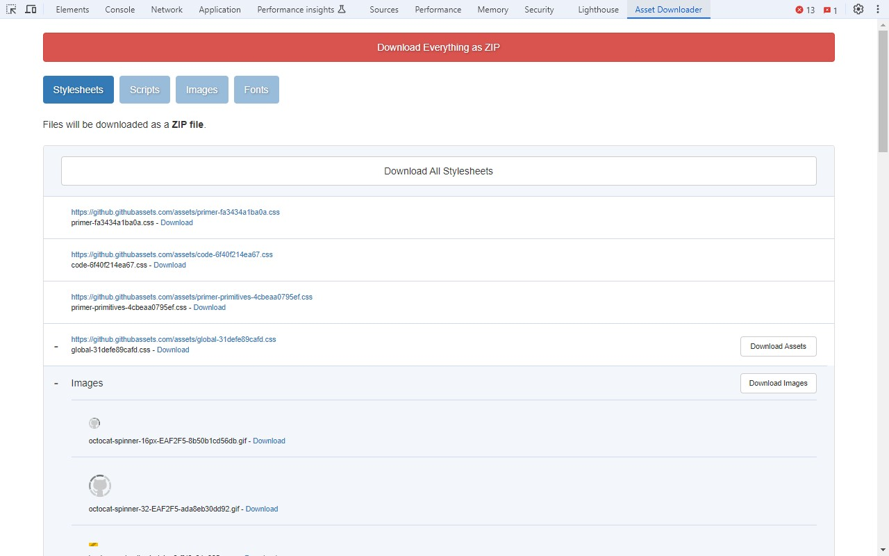

# Chrome Asset Downloader Extension

[Chrome Asset Downloader](https://chromewebstore.google.com/detail/asset-downloader/iaejdgeeecpdmnnjnncnajkbagpoiikg) is an extension for Chrome Devevloper Tools which lets you view and download all images, fonts, stylesheets, and scripts from a web page as a ZIP file. It will also find and download images and fonts that are unused on the current page but are present in the stylesheets.

## Getting Started

This extension will add a new panel to your Chrome Developers Tools named "Asset Downloader". To use this extension:

1. Open your Developer Tools by pressing F12 or right clicking on a page and selecting "Inspect".
2. In the top tabs of Developp Tools, click on "Asset Downloader" (you might need to click on the ">>" more button to find the tab).
3. You will now see a list of all Stylesheets, Scripts, Images, and Fonts on the page. You can download all of the page assets by clicking the red button "Download Everything as ZIP" at the top of the panel.
4. The first time that you download assets, you will be prompted to grant the "Host" permission to this plugin. You can optionally choose to deny the permission, however some files might fail to download if you do not grant the permission.
5. The ZIP file will be saved as "CURRENT_PAGE_TITLE.zip".

You can also choose to download single files by clicking the "Download" button next to the file, or you can download a ZIP file with just certain assets such as stylesheets, images, scripts, or fonts.

## Releases

See [CHANGELOG](CHANGELOG.md)
